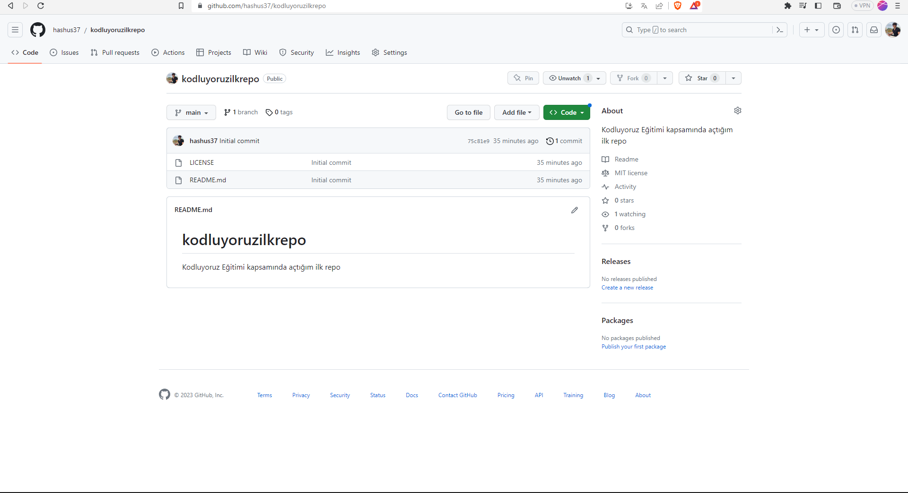

# KOdluyoruz Ilk Repo
Kodluyoruz Eğitimi kapsamında açtığım ilk repo. İçerisnde bir adet README dosyası, bir adet de index.html barındırıyor.

# image


# Installation
Öncelikle Projeyi clonelayın. (buraya sizin reponuzdan aldığınız link gelecek)
```
https://github.com/hashus37/kodluyoruzilkrepo.git
```

# Usage
Projeyi cloneladıktan sonra Visual Studio Code programıonda açınız.

linux için 

```
cd kodluyoruzilkrepo
code .
```

